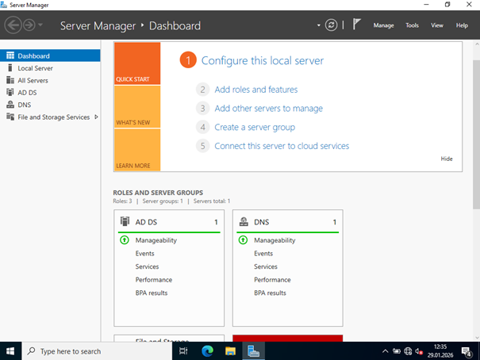
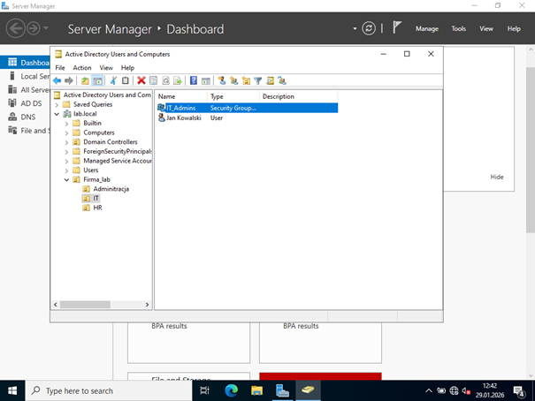
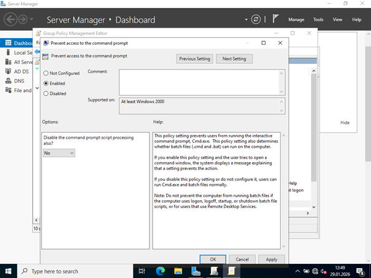
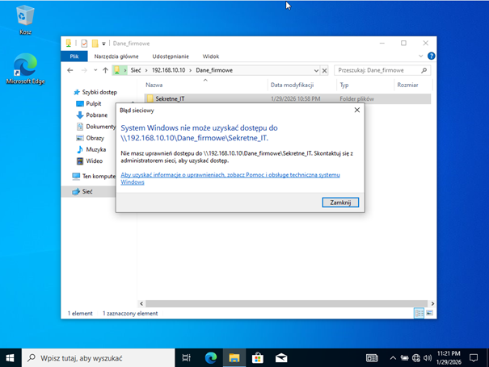
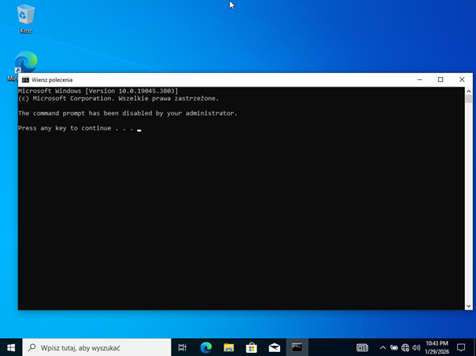
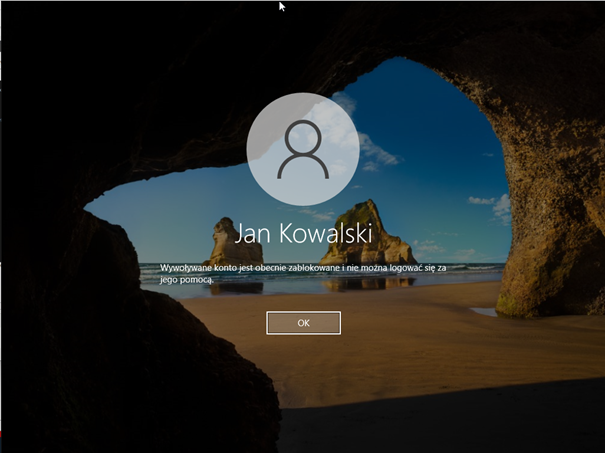

# Secure Enterprise Infrastructure Lab (Windows Server 2022 & Active Directory)

## 📝 Project Overview
This project demonstrates the deployment and securing of a corporate IT infrastructure using a virtualized environment. The lab consists of a **Windows Server 2022 Domain Controller** and a **Windows 10 Pro** workstation. The primary focus was on implementing **Identity and Access Management (IAM)**, **Group Policy Objects (GPO) Hardening**, and **Network Security** principles.

### 🛠️ Tech Stack & Tools
* **OS:** Windows Server 2022 (Standard Evaluation), Windows 10 Pro
* **Services:** Active Directory Domain Services (AD DS), DNS, GPO, NTFS File Services
* **Virtualization:** Oracle VirtualBox
* **Networking:** Internal Virtual Network (isolated environment)

---

## 🏗️ Lab Architecture
* **Domain Controller:** `DC-01` | IP: `192.168.10.10` | Domain: `lab.local`
* **Client Workstation:** `WIN10-CL1` | IP: `192.168.10.20`
* **Test User:** `j.kowalski` (Department: IT)

---

## 🚀 Implementation Steps

### 1. Active Directory Setup
* Installed Windows Server 2022 and configured a static IP address.
* Promoted the server to a **Domain Controller** and established the `lab.local` forest.
* Configured **DNS** to ensure proper name resolution across the domain.

---

### 2. Organizational Structure & RBAC
* Designed a logical **Organizational Unit (OU)** structure (IT, HR, Administration).
* Implemented **Role-Based Access Control (RBAC)** by creating security groups (e.g., `IT_Admins`) and assigning users based on the **Principle of Least Privilege**.

---

### 3. Security Hardening via GPO
Applied critical security policies to minimize the attack surface:
* **Command Prompt Restriction:** Disabled CMD for standard users to prevent unauthorized script execution.
* **Account Lockout Policy:** Configured a threshold of 5 failed login attempts to protect against Brute Force attacks.
* **Control Panel Access:** Restricted access to system settings for non-admin users.

---

### 4. Secure File Services (NTFS Permissions)
* Configured a network share with granular permissions.
* Implemented **Inheritance Blocking** on sensitive folders.
* Verified that only members of the `IT_Admins` group can access restricted data, while other users receive an "Access Denied" message.

---

## 🧪 Verification & Results
The security measures were successfully validated on the Windows 10 client:
1. **GPO Validation:** Attempting to open CMD as `j.kowalski` results in: *"The command prompt has been disabled by your administrator."*
2. **Brute Force Protection:** After 5 incorrect password attempts, the account was successfully locked out at the Domain Controller level.
3. **Access Control:** Verified that unauthorized users cannot access the `Sekretne_IT` network share.

---

## 🧠 Key Skills Demonstrated
* Windows Server Administration & Infrastructure Design.
* Understanding of Active Directory objects and hierarchy.
* Proficiency in Group Policy management for system hardening.
* Implementation of NTFS and Share permissions (Security auditing).
* Network configuration in virtualized environments.
